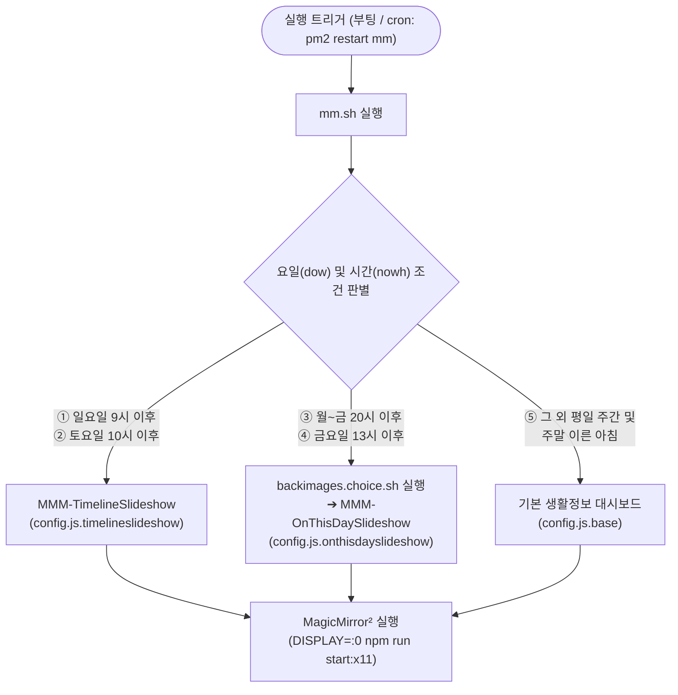

# MagicMirror² 요일별 / 시간대별 모듈 실행 가이드

MagicMirror² 환경([`new-horizons-conf/magicmirror`](file:///home/pi/new-horizons-conf/magicmirror))에서 동작하는 요일별, 시간대별 모듈 실행 구성과 자동 전환 스케줄을 정리한 가이드 문서입니다.

> 최종 점검: 2026-09-28 — 실제 설치본(`/home/pi/MagicMirror`)의 `mm.sh`, `config/`, `modules/` 코드와 대조하여 갱신

---

## 📌 목차
1. [실행 및 스케줄링 메커니즘](#1-실행-및-스케줄링-메커니즘)
2. [요일별 / 시간대별 실행 매트릭스](#2-요일별--시간대별-실행-매트릭스)
3. [설정 프로필별 상세 모듈 구성](#3-설정-프로필별-상세-모듈-구성)
   - [기본 생활정보 대시보드 (`config.js.base`)](#1-기본-생활정보-대시보드-configjsbase)
   - [과거의 오늘 슬라이드쇼 (`config.js.onthisdayslideshow`)](#2-과거의-오늘-슬라이드쇼-configjsonthisdayslideshow)
   - [타임라인 슬라이드쇼 (`config.js.timelineslideshow`)](#3-타임라인-슬라이드쇼-configjstimelineslideshow)
4. [Crontab 및 시스템 전원 연계 스케줄](#4-crontab-및-시스템-전원-연계-스케줄)
5. [설치 모듈 현황](#5-설치-모듈-현황)
6. [⚠️ 알려진 이슈](#6-️-알려진-이슈)
7. [관련 핵심 파일 목록](#7-관련-핵심-파일-목록)

---

## 1. 실행 및 스케줄링 메커니즘

매직미러는 기기 부팅 시 `pm2-pi.service`가 PM2 덤프를 복원하면서 `mm` 프로세스(스크립트: `/home/pi/MagicMirror/mm.sh`, cwd: `/home/pi/MagicMirror`)를 실행합니다.
`mm.sh`는 현재 **요일(`dow`: `date +%u`, 1=월 ~ 7=일)**과 **시각(`nowh`: `date +%-H`, 0~23)**을 판별하여, `new-horizons-conf/magicmirror/` 아래의 설정 파일을 `/home/pi/MagicMirror/config/config.js`로 복사(또는 생성)한 뒤 매직미러를 기동합니다.

> `/home/pi/MagicMirror/mm.sh`와 `new-horizons-conf/magicmirror/mm.sh`는 첫 줄 `logger` 문구만 다르고 로직은 동일합니다.

### `mm.sh` 분기 조건 (위에서부터 순서대로 평가)

| 순서 | 조건 (코드) | 실제 의미 | 동작 |
| :---: | :--- | :--- | :--- |
| ① | `dow == 7 && nowh > 8` | **일요일 09:00 이후** | `config.js.timelineslideshow` 복사 |
| ② | `dow == 6 && nowh > 9` | **토요일 10:00 이후** | `config.js.timelineslideshow` 복사 |
| ③ | `nowh >= 20` | **월~금 20:00 이후** (토·일은 ①②에서 먼저 걸림) | `backimages.choice.sh` 실행 → `config.js.onthisdayslideshow` 생성 |
| ④ | `dow == 5 && nowh > 12` | **금요일 13:00 ~ 19:59** | `backimages.choice.sh` 실행 → `config.js.onthisdayslideshow` 생성 |
| ⑤ | 그 외 | 평일 20시 이전(금요일은 13시 이전), 토 10시 이전, 일 9시 이전 | `config.js.base` 복사 |

### `backimages.choice.sh` 동작 (OnThisDay 사전 처리)
1. `/media/pi/SSD-256-USB/PHOTOS/` 바로 아래 디렉토리 목록을 수집합니다 (이름에 `jwst`가 포함된 폴더 제외).
2. 폴더 생성 시각(`stat %W`, 없으면 수정 시각) 오름차순으로 정렬합니다.
3. **이달의 일자**(`date +%d`, 1~31)에서 1을 뺀 값을 폴더 수로 나눈 나머지를 인덱스로 사용합니다. (변수명은 `week_num`이지만 실제로는 주차가 아니라 **일자 기준**)
4. `config.js.onthisdayslideshow`의 `@IMG_DIR@`를 선택된 폴더명으로 치환하여 `/home/pi/MagicMirror/config/config.js`에 기록합니다.

> 이 스크립트는 2026-09-27 커밋(`204563b`)에서 실수로 삭제됐다가 2026-09-28에 복구되었습니다.

---

## 2. 요일별 / 시간대별 실행 매트릭스

| 요일 | 시간대 | 적용 설정 파일 | 실행 모듈 | 화면 구성 및 주요 동작 |
| :--- | :--- | :--- | :--- | :--- |
| **월 ~ 목** | **07:00 ~ 08:00** (기상 및 출근 준비) | [`config.js.base`](file:///home/pi/new-horizons-conf/magicmirror/config.js.base) | **기본 대시보드** (시계, 캘린더, 날씨 등) | • 출근 전 시간별/주간 날씨, 캘린더 일정 확인 • 슬라이드쇼 OFF • 08:00 자동 셧다운 |
| | 08:00 ~ 20:00 | - | *(전원 종료 / 절전)* | • 이 시간에 켜지면 `config.js.base` 표시 (09:05 재시작 포함) |
| | **20:00 ~ 21:55** (퇴근 후 야간) | [`config.js.onthisdayslideshow`](file:///home/pi/new-horizons-conf/magicmirror/config.js.onthisdayslideshow) | **`MMM-OnThisDaySlideshow`** `clock` | • **과거의 오늘(당일 월/일) 사진** 우선 재생 • 완료/부재 시 로컬 앨범 폴더 모드로 전환 • 21:55 야간 자동 셧다운 (22시 스마트 플러그 OFF 대비) |
| **금요일** | **07:00 ~ 08:00** | [`config.js.base`](file:///home/pi/new-horizons-conf/magicmirror/config.js.base) | **기본 대시보드** | • 기본 날씨 및 일정 확인 (08:00 자동 셧다운) |
| | 08:00 ~ 12:59 | [`config.js.base`](file:///home/pi/new-horizons-conf/magicmirror/config.js.base) | **기본 대시보드** | • 이 시간에 켜지면 기본 화면 |
| | **13:00 ~ 20:00** (오후 부팅 시) | [`config.js.onthisdayslideshow`](file:///home/pi/new-horizons-conf/magicmirror/config.js.onthisdayslideshow) | **`MMM-OnThisDaySlideshow`** `clock` | • 금요일 오후 기기 부팅 시 OnThisDay 슬라이드쇼 조기 구동 (`nowh > 12`) |
| | **20:00 ~ 22:00** (주말 전야) | [`config.js.onthisdayslideshow`](file:///home/pi/new-horizons-conf/magicmirror/config.js.onthisdayslideshow) | **`MMM-OnThisDaySlideshow`** `clock` | • 과거의 오늘 + 로컬 앨범 슬라이드쇼 • 20:00 주간 DB 복구(stock, vote) 동시 진행 • 22:00 야간 자동 셧다운 |
| **토요일** | **00:00 ~ 09:59** (이른 아침) | [`config.js.base`](file:///home/pi/new-horizons-conf/magicmirror/config.js.base) | **기본 대시보드** | • 10:00 이전 부팅 시 기본 정보 화면 표시 |
| | **10:00 ~ 22:00** (주말 종일) | [`config.js.timelineslideshow`](file:///home/pi/new-horizons-conf/magicmirror/config.js.timelineslideshow) | **`MMM-TimelineSlideshow`** `clock` | • **과거 ➔ 현재 시간순 일자별 타임라인** (해외 여행 위주) • 일별 최대 30장, 10장 미만 날짜 제외, 이어보기 • 10:10 재시작으로 전환, 22:00 자동 셧다운 |
| **일요일** | **00:00 ~ 08:59** (이른 아침) | [`config.js.base`](file:///home/pi/new-horizons-conf/magicmirror/config.js.base) | **기본 대시보드** | • 09:00 이전 부팅 시 기본 정보 화면 표시 |
| | **09:00 ~ 22:00** (주말 종일) | [`config.js.timelineslideshow`](file:///home/pi/new-horizons-conf/magicmirror/config.js.timelineslideshow) | **`MMM-TimelineSlideshow`** `clock` | • 토요일 감상 시점에 이어서 연속 진행 (`data/timeline_state.json`) • 22:00 자동 셧다운 |

---

## 3. 설정 프로필별 상세 모듈 구성

> 세 프로필 모두 `new-horizons-conf/magicmirror/`가 원본이며, `/home/pi/MagicMirror/config/` 아래의 동명 파일은 동일한 사본입니다. (`mm.sh`는 `new-horizons-conf` 쪽을 복사)

### 1) 기본 생활정보 대시보드 (`config.js.base`)
* **실행 시점**: 평일 아침·주간(월~목 20시 이전, 금 13시 이전), 토요일 10시 이전, 일요일 9시 이전
* **특징**: 배경 슬라이드쇼 없이 출근/등교 시간대에 필요한 실시간 생활 정보에 집중합니다. (`language: "en"`, `locale: "en-US"`)

| 모듈명 | 화면 위치 | 주요 설정 및 역할 |
| :--- | :--- | :--- |
| **`alert`** / **`updatenotification`** | 기본 / `top_bar` | 시스템 알림 및 모듈 업데이트 통지 |
| **`clock`** | `top_center` | 중앙 대형 디지털 시계, 날짜(`YYYY. MM. DD (ddd)`) |
| **`calendar`** | `top_center` | **오늘의 일정**: 당일 이벤트만 표시 (최대 10개, iCloud 개인 캘린더 + 대한민국 공휴일) |
| **`MMM-OpenMeteoHourlyGrid`** | `bottom_center` | **시간별 날씨**: 향후 24시간(`hoursToShow: 24`) 날씨 아이콘·기온·강수 그리드 (Open-Meteo API, 10분 주기) |
| **`MMM-Globe`** | `fullscreen_below` | 회전하는 지구본 그래픽 |
| **`MMM-WeatherEffects`** | `fullscreen_above` | Open-Meteo 현재 날씨 연동 비/눈 캔버스 애니메이션 (`effect: "auto"`, 5분 주기) |
| **`compliments`** | `fullscreen_above` | GitHub `new-horizons-conf/compliments.json` 원격 파일 기반 문구 롤링 |
| **`MMM-AccuWeatherForecastDeluxe`** | `top_right` | **상세 예보**: 시간별 + 일간 타일 레이아웃 (`language: "kr"`) |
| **`calendar`** | `top_right` | **예정된 일정**: 오늘 이후 다가오는 일정 최대 8개 |
| **`weather`** | `top_left` | Open-Meteo 기반 일간 예보(`type: "forecast"`, 최대 9일) |
| **`MMM-PiTemp`** | `bottom_left` | 라즈베리 파이 CPU 온도 |
| **`MMM-MoonPhase`** | `bottom_right` | 달의 위상 그래픽 |

* **비활성 모듈**: `MMM-OneCallWeather`(`disabled: true`), `newsfeed`(주석 처리)

---

### 2) 과거의 오늘 슬라이드쇼 (`config.js.onthisdayslideshow`)
* **실행 시점**: 월~금 20:00 ~ 셧다운, 금요일 13:00 ~ 20:00
* **사전 처리**: `backimages.choice.sh`가 `/media/pi/SSD-256-USB/PHOTOS` 아래 앨범 폴더 중 하나를 선택하여 `@IMG_DIR@`를 치환합니다. ([1장](#backimageschoicesh-동작-onthisday-사전-처리) 참고)
* **구성 모듈**:
  1. **`MMM-OnThisDaySlideshow`** (`fullscreen_below`):
     - **과거의 오늘 조회** (`dateRangeDays: 0`): MariaDB `photo.photos`에서 `MONTH(taken_at)`·`DAY(taken_at)`가 오늘과 같은 사진을 **촬영 시각 오름차순**(오래된 해부터)으로 재생하며 **"N년 전 오늘"** 배지를 표시합니다. 실제 파일이 존재하는 사진만 사용합니다.
     - **폴더 모드 자동 전환**: 오늘 사진을 모두 재생했거나 0장이면 `imagePaths`(치환된 앨범 폴더, 하위 폴더 포함) 사진을 **무작위 순서**로 반복 재생합니다. 폴더 사진도 `filepath`로 DB를 조회해 촬영 정보가 있으면 함께 표시합니다.
     - **날짜 변경 감지**: 10분마다 날짜를 확인하여 자정이 지나면 재생 목록을 새로 만들고 과거의 오늘 모드로 복귀합니다.
     - **세로 사진**: `contain` 맞춤 + 좌측 다크 테마(`dark`) Leaflet 지도(국가 맞춤, 청록 `#00d2d3` 국가 하이라이트) + 우측 정보 카드
     - **가로 사진**: 상단 중앙에 촬영 일자/위치 헤더 5초 표시, 좌측 상단 정보 패널은 숨김
  2. **`clock`** (`top_center`): 24시간제 디지털 시계 및 일출/일몰 시간 표시.

---

### 3) 타임라인 슬라이드쇼 (`config.js.timelineslideshow`)
* **실행 시점**: 토요일 10:00 ~ 22:00, 일요일 09:00 ~ 22:00
* **구성 모듈**:
  1. **`MMM-TimelineSlideshow`** (`fullscreen_below`):
     - **일자별 시간순 재생** (`groupBy: "day"`): 촬영일(`YYYY-MM-DD`)별로 묶어 과거 ➔ 현재 순으로 재생합니다. 하루 최대 30장(`photosPerDay: 30`), 날짜 내부는 촬영 시간순.
     - **유의미한 날짜만** (`minPhotosPerDay: 10`): 하루 촬영 사진이 10장 미만인 날은 건너뜁니다.
     - **국내 사진 제외 (코드 기본값)**: `excludeKorea`가 기본 `true`여서 한반도 GPS 범위(위도 33.1~38.6, 경도 126.0~129.6) 사진과 국내 여행/행사 앨범(웨딩·강원·여수·강릉·제주·남해·울릉·곤지암 등 키워드)이 제외됩니다. → 사실상 **해외여행 타임라인**
     - **미표시 사진 우선**: 표시할 때마다 `photos.screen_at`을 갱신하고, 선택 시 `screen_at IS NULL` → 오래전에 본 사진 순으로 우선합니다.
     - **이어보기** (`resumeTimeline: true`): 마지막으로 본 날짜를 `modules/MMM-TimelineSlideshow/data/timeline_state.json`에 저장하고, 재시작 시 그 다음 날짜부터 재생합니다. 끝까지 보면 상태를 초기화하고 새 랜덤 묶음으로 처음부터 다시 시작합니다.
     - **세계지도 연출**: 시작 시 30초간 방문 국가 오버뷰 지도, 새 날짜 진입 시 10초 세계지도 인트로 + 화면 중앙 대형 일자/도시 타이틀
     - **지도 테마**: 라벨 없는 밝은 지도(`light_nolabels`, zoom 2.2) + 빨간색(`#ff4757`) 국가 하이라이트 — OnThisDay의 다크 테마와 다릅니다.
  2. **`clock`** (`top_center`): 24시간제 디지털 시계 및 일출/일몰 시간 표시.

---

## 4. Crontab 및 시스템 전원 연계 스케줄

시스템 크론탭([`secondpi.crontab`](file:///home/pi/new-horizons-conf/raspi/secondpi/secondpi.crontab), 실제 `crontab -l`과 동일)을 통해 정해진 시간마다 매직미러를 재시작하여 모듈을 전환하고, 자동 전원 관리를 수행합니다. 로그는 `/home/pi/cron_log/*.log`에 저장됩니다.

| 시각 | 대상 요일 | 실행 명령 / 작업 내용 | 동작 효과 |
| :---: | :---: | :--- | :--- |
| **07:15** | 월 ~ 금 | `pm2 restart mm` | 아침 기상 화면 갱신 ➔ `config.js.base` |
| **08:00** | 월 ~ 금 | `sudo shutdown -h now` | 출근/외출 후 자동 종료 |
| **09:05** | 월 ~ 금 | `pm2 restart mm` | 오전 화면 갱신 (휴일 등 켜져 있을 때 대비) ➔ `config.js.base` |
| **10:10** | 토, 일 | `pm2 restart mm` | 주말 오전 화면 갱신 ➔ `config.js.timelineslideshow` |
| **20:00** | 금요일 | `restore_backup.sh` (flock) | 주간 MariaDB 복구 (stock, vote) |
| **20:00** | 매일 | `pm2 restart mm` | 야간 전환 (평일: OnThisDay / 주말: Timeline 유지) |
| **21:00** | 매일 | `push.git.sh secondpi`, `db_backup.sh`, `cleanup_backup.sh` | 설정 Git 푸시, photo DB 백업, 백업 최근 7개 유지 |
| **21:55** | 월 ~ 목 | `sudo shutdown -h now` | 평일 야간 자동 종료 (22:00 스마트 플러그 차단 대비) |
| **22:00** | 금 ~ 일 | `sudo shutdown -h now` | 주말 야간 자동 종료 |

---

## 5. 설치 모듈 현황

`/home/pi/MagicMirror/modules/` 기준 (✅ 사용 중 / ⏸ 설치만 됨)

| 모듈 | 상태 | 사용 프로필 | 비고 |
| :--- | :---: | :--- | :--- |
| `MMM-TimelineSlideshow` | ✅ | timelineslideshow | 커스텀, 저장소에 소스 백업 |
| `MMM-OnThisDaySlideshow` | ✅ | onthisdayslideshow | 커스텀, 저장소에 소스 백업 |
| `MMM-OpenMeteoHourlyGrid` | ✅ | base | 커스텀, 저장소에 소스 백업 |
| `MMM-WeatherEffects` | ✅ | base | 커스텀, 저장소에 소스 백업 |
| `MMM-AccuWeatherForecastDeluxe` | ✅ | base | 서드파티 |
| `MMM-Globe` | ✅ | base | 서드파티 |
| `MMM-MoonPhase` | ✅ | base | 서드파티 |
| `MMM-PiTemp` | ✅ | base | 서드파티 |
| `MMM-MySlideshow` | ⏸ | `config.js.backimages`, `config.js.myslideshow` (현재 스케줄 미사용) | 커스텀, 저장소에 소스 백업 |
| `MMM-SmartSlideshow` | ⏸ | 없음 | 커스텀, 저장소에 소스 백업 |
| `MMM-OneCallWeather` | ⏸ | base (`disabled: true`) | 서드파티 |
| `MMM-BackgroundSlideshow` | ⏸ | 없음 | 오픈소스 원본 |
| `MMM-GooglePhotos` | ⏸ | `config.js.googlephoto` (구버전) | 서드파티 |
| `MMM-Moon`, `MMM-WeatherChart` | ⏸ | 없음 | 서드파티 |

> 커스텀 모듈 6종은 `new-horizons-conf/magicmirror/MMM-*`와 설치본의 소스가 동일합니다 (런타임 파일 `timeline_state.json`, `filesShownTracker.txt` 제외).

---

## 6. ⚠️ 알려진 이슈

1. ~~**`backimages.choice.sh` 누락**~~ ✅ 해결 (2026-09-28): 9/27 커밋(`204563b`)에서 삭제되어 평일 야간·금요일 오후에 `config.js`가 교체되지 않던 문제. 이전 커밋에서 스크립트를 복구했습니다.
2. **2026-09-28 현재 `config.js` 상태**: 14:41 부팅 때 만들어진 `config.js`의 내용이 `config.js.backimages`(`MMM-MySlideshow`, `26.09.BALI` 폴더)입니다. 현재 `mm.sh` 로직이라면 월요일 14시에는 base여야 하므로, 부팅 당시에는 다른 버전의 `mm.sh`가 실행된 것으로 보입니다 (`mm.sh`는 15:09에 수정됨).
3. **부팅 시 `pm2-pi.service` 타임아웃**: 부팅 로그에 `start operation timed out` 후 재시작되는 기록이 있습니다. 두 번째 시도에서 정상 복원되지만 기동이 늦어집니다.

---

## 7. 관련 핵심 파일 목록

* **실행 제어 스크립트**: [`/home/pi/MagicMirror/mm.sh`](file:///home/pi/MagicMirror/mm.sh) (PM2가 실행) / 백업본 [`new-horizons-conf/magicmirror/mm.sh`](file:///home/pi/new-horizons-conf/magicmirror/mm.sh)
* **앨범 자동 선택 스크립트**: [`new-horizons-conf/backimages.choice.sh`](file:///home/pi/new-horizons-conf/backimages.choice.sh)
* **설정 프로필 원본**: [`new-horizons-conf/magicmirror/config.js.*`](file:///home/pi/new-horizons-conf/magicmirror/)
* **슬라이드쇼 상세 가이드**: [`new-horizons-conf/magicmirror/SLIDESHOW_MODULES.md`](file:///home/pi/new-horizons-conf/magicmirror/SLIDESHOW_MODULES.md)
* **크론탭 작업 정의서**: [`new-horizons-conf/raspi/secondpi/CRONTAB.md`](file:///home/pi/new-horizons-conf/raspi/secondpi/CRONTAB.md)
* **매직미러 커스텀 스타일**: [`new-horizons-conf/magicmirror/custom.css`](file:///home/pi/new-horizons-conf/magicmirror/custom.css) (설치본 `config/custom.css`와 동일)
