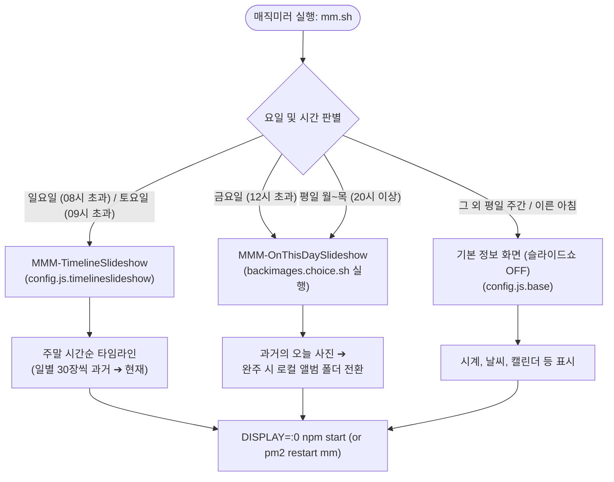

# MagicMirror² SlideShow 모듈 가이드

MagicMirror² 환경에 구축된 사진 슬라이드쇼 모듈들의 상세 기능, 설정 방법, 요일별 실행 스케줄 및 공통 기능에 대한 종합 가이드입니다.

---

## 📌 목차
1. [슬라이드쇼 모듈 개요](#1-슬라이드쇼-모듈-개요)
2. [모듈별 상세 설명](#2-모듈별-상세-설명)
   - [MMM-TimelineSlideshow (타임라인 슬라이드쇼)](#mmm-timelineslideshow)
   - [MMM-OnThisDaySlideshow (과거의 오늘 슬라이드쇼)](#mmm-onthisdayslideshow)
   - [MMM-SmartSlideshow (스마트 하이브리드 슬라이드쇼)](#mmm-smartslideshow)
   - [MMM-MySlideshow (로컬 폴더 슬라이드쇼)](#mmm-myslideshow)
   - [MMM-BackgroundSlideshow (기본 백그라운드)](#mmm-backgroundslideshow)
3. [공통 프리미엄 기능 및 시각 연출](#3-공통-프리미엄-기능-및-시각-연출)
   - [가로 사진(Landscape) 헤더 팝업](#가로-사진landscape-헤더-팝업)
   - [세로 사진(Portrait) 화면 분할 & 지도/정보 카드](#세로-사진portrait-화면-분할--지도정보-카드)
   - [MariaDB 연동 및 screen_at 재생 이력 관리](#mariadb-연동-및-screen_at-재생-이력-관리)
4. [요일별 실행되는 SlideShow 정리 및 스케줄링 정책](#4-요일별-실행되는-slideshow-정리-및-스케줄링-정책)
   - [요일별/시간대별 실행 매트릭스](#요일별시간대별-실행-매트릭스)
   - [실행 흐름 다이어그램 (`mm.sh`)](#실행-흐름-다이어그램-mmsh)
   - [요일별 모듈 전환 및 동작 메커니즘](#요일별-모듈-전환-및-동작-메커니즘)
   - [Crontab 연동 재시작 주기](#crontab-연동-재시작-주기)
5. [관련 파일 경로 안내](#5-관련-파일-경로-안내)

---

## 1. 슬라이드쇼 모듈 개요

| 모듈명 | 데이터 소스 | 핵심 특징 | 주요 실행 시점 |
| :--- | :--- | :--- | :--- |
| **`MMM-TimelineSlideshow`** | MariaDB (`photos`) | 과거(2006년~)부터 현재까지 시간순 타임라인 재생 (일별 30장씩 추출, 이어보기) | **주말 (토/일)** |
| **`MMM-OnThisDaySlideshow`** | MariaDB + 로컬 폴더 | "과거의 오늘" 사진 우선 재생 후 로컬 폴더 앨범 자동 전환 | **평일 야간 / 금요일 오후** |
| **`MMM-SmartSlideshow`** | MariaDB + 로컬 폴더 | 과거의 오늘(±7일)과 로컬 갤러리를 결합한 하이브리드 모듈 | 수동/특수 설정 시 |
| **`MMM-MySlideshow`** | 로컬 디렉토리 | 로컬 폴더 기반 슬라이드쇼 + 세로사진 지도/정보 UI의 원형 | 앨범 전용 |
| **`MMM-BackgroundSlideshow`** | 로컬 디렉토리 | 오픈소스 원본 백그라운드 이미지 슬라이드쇼 모듈 | 기본 배경 |

---

## 2. 모듈별 상세 설명

### MMM-TimelineSlideshow
* **위치**: `modules/MMM-TimelineSlideshow/`
* **설명**: MariaDB의 사진들을 촬영일자 기준 **시간순(과거 ➔ 현재)**으로 흘러가며 재생하는 타임라인 모듈입니다.
* **주요 기능**:
  1. **일별/월별 그룹핑 (`groupBy: "day"` 또는 `"month"`)**:
     - 기본값으로 사진이 있는 날마다 랜덤으로 지정된 장수(`photosPerDay: 30`)를 추출하여 시간순으로 표시합니다.
     - `minPhotosPerDay: 10`: 여행이나 이벤트처럼 하루 10장 이상 촬영된 의미 있는 날 위주로 필터링합니다.
  2. **중복 방지 및 이어보기 (`resumeTimeline`, `avoidRecentPhotos`)**:
     - `screen_at` 필드를 활용하여 이미 최근에 재생된 사진을 제외하고 새로운 사진을 우선 선택합니다.
     - 재실행 시 맨 처음(2006년)부터 다시 시작하지 않고, 이전에 마지막으로 보았던 날짜의 다음 날부터 이어 재생합니다.
  3. **타임라인 배지**:
     - 상단 또는 정보창에 `⏳ 2018년 5월 26일 (2 / 30)` 및 전체 진행률 `[45 / 1780]`, `8년 전` 배지를 표시합니다.
  4. **일자별 타이틀 인트로 (`showMonthCenterTitle: true`)**:
     - 새로운 날짜로 넘어갈 때 첫 번째 사진 중앙에 날짜와 도시명을 큼직하게 띄워 여행지를 한눈에 인지할 수 있도록 합니다.

---

### MMM-OnThisDaySlideshow
* **위치**: `modules/MMM-OnThisDaySlideshow/`
* **설명**: 현재 날짜(월/일)와 일치하는 **"과거의 오늘"** 사진을 MariaDB에서 자동으로 검색하여 재생하는 모듈입니다.
* **주요 기능**:
  1. **과거의 오늘 자동 검색 (`dateRangeDays: 0`)**:
     - 오늘 날짜(예: 09월 14일)에 촬영된 과거 모든 연도의 사진들을 조회합니다.
     - `dateRangeDays`를 늘리면(예: 7) 오늘 기준 전후 1주일 동안의 과거 사진도 포함 가능합니다.
  2. **"N년 전 오늘" 뱃지 (`showYearsAgoBadge: true`)**:
     - `5년 전 오늘`, `1년 전 오늘` 등 직관적인 과거 시점 배지를 표시합니다.
  3. **로컬 폴더 자동 전환 (Smart Fallback)**:
     - 오늘 날짜에 촬영된 사진이 없거나, 과거의 오늘 사진을 모두 완주했을 경우 자동으로 지정된 로컬 폴더(`imagePaths: ['/media/pi/SSD-256-USB/PHOTOS/@IMG_DIR@']`)의 갤러리 모드로 자동 전환되어 슬라이드쇼가 멈추지 않습니다.
  4. **자정 자동 갱신 (Daily Roll-over)**:
     - 밤 00:00 자정이 지나면 날짜 변경을 감지하고 새 날짜의 과거 사진을 자동으로 재쿼리합니다.

---

### MMM-SmartSlideshow
* **위치**: `modules/MMM-SmartSlideshow/`
* **설명**: `MMM-MySlideshow`와 `MMM-OnThisDaySlideshow`의 기능을 결합한 스마트 하이브리드 모듈입니다.
* **동작**: 기본적으로 오늘 기준 ±7일 범위의 사진을 먼저 보여주고, 완료 시 로컬 앨범 폴더로 전환됩니다.

---

### MMM-MySlideshow
* **위치**: `modules/MMM-MySlideshow/`
* **설명**: 로컬 이미지 디렉토리(`imagePaths`)의 사진들을 순차적/무작위로 보여주는 커스텀 모듈입니다.
* **특징**: 세로 사진 자동 비율 유지, 좌측 Leaflet 지도 연동, 우측 메타데이터 카드 UI의 기반이 된 모듈입니다.

---

### MMM-BackgroundSlideshow
* **위치**: `modules/MMM-BackgroundSlideshow/`
* **설명**: MagicMirror 커뮤니티의 표준 오픈소스 백그라운드 슬라이드쇼 모듈입니다. 전체화면 배경 이미지 렌더링에 최적화되어 있습니다.

---

## 3. 공통 프리미엄 기능 및 시각 연출

사용자 맞춤 커스텀이 적용된 공통 핵심 기능들입니다:

### 가로 사진(Landscape) 헤더 팝업
* 가로 사진이 화면 전체에 표시될 때, 중앙 상단에 **촬영 일시, 도시 및 국가 정보**를 반투명 오버레이로 5초간 띄운 뒤 부드럽게 사라집니다.
* 설정값:
  ```javascript
  showLandscapeHeader: true,
  landscapeHeaderDuration: 5000,
  landscapeHeaderTop: "30px"
  ```

### 세로 사진(Portrait) 화면 분할 & 지도/정보 카드
스마트폰 등으로 촬영된 세로 사진이 좌우로 과도하게 확대되어 얼굴이나 구도가 잘리는 문제를 방지합니다.
* **중앙**: 비율을 유지한 세로 사진 원본(`contain` 모드, 얼굴 잘림 방지).
* **좌측 영역 (다크 테마 미니맵)**:
  - Leaflet 기반 다크 타일맵 적용.
  - 사진에 기록된 GPS 좌표에 펄싱(Pulsing) 마커 핀 표시.
  - 촬영 국가 GeoJSON 경계선 네온 하이라이트.
  - **특수 도서 지역 특화**: 하와이, 괌 등 미국 본토와 멀리 떨어진 지역 사진의 경우 해당 섬 영역이 확대 표시되도록 좌표 바운드 최적화.
* **우측 영역 (글래스모피즘 정보 카드)**:
  - 년/월/일 진행 배지 및 N년 전 오늘 배지.
  - 촬영 일시(날짜, 요일, 시간).
  - 촬영 위치(국가, 도시).
  - 앨범명 및 카메라 모델 정보.

### MariaDB 연동 및 screen_at 재생 이력 관리
* MariaDB `photo` 데이터베이스의 `photos` 테이블과 연동:
  - 접속 계정: `stock` / `localhost:3306`
* **중복 방지 메커니즘**:
  - 사진이 화면에 출력될 때 해당 사진 레코드의 `screen_at` 컬럼에 현재 시각을 업데이트합니다.
  - 다음 쿼리 시 `screen_at IS NULL` 또는 가장 오래전에 표시된 사진을 우선 정렬함으로써 항상 새로운 사진을 볼 수 있습니다.

---

## 4. 요일별 실행되는 SlideShow 정리 및 스케줄링 정책

MagicMirror²는 [`mm.sh`](file:///home/pi/MagicMirror/mm.sh) 실행 스크립트와 시스템 크론탭([`secondpi.crontab`](file:///home/pi/new-horizons-conf/raspi/secondpi/secondpi.crontab))의 연계를 통해 **요일과 시간대에 따라 서로 다른 슬라이드쇼 모듈 및 설정 파일(`config.js`)이 자동 교체**되어 동작합니다.

### 요일별/시간대별 실행 매트릭스

| 요일 | 시간대 | 적용 슬라이드쇼 모듈 | 적용 설정 파일 | 동작 및 콘텐츠 특징 |
| :--- | :--- | :--- | :--- | :--- |
| **월 ~ 목** | 07:00 ~ 08:20 (기상/출근) | *(슬라이드쇼 OFF)* | `config.js.base` | 시계, 날씨, 캘린더, 알림 등 기본 정보에 집중 |
| | 08:20 ~ 19:xx (낮 시간) | *(시스템 전원 종료)* | - | 08:20 자동 셧다운 (외출 시간 전력 절감) |
| | **20:00 ~ 21:55 (야간)** | **`MMM-OnThisDaySlideshow`** | `config.js.onthisdayslideshow` (`backimages.choice.sh` 치환) | **과거의 오늘 사진** 재생 ➔ 소진 시 일자 기반 **랜덤 로컬 앨범** 자동 전환 |
| | 21:55 ~ 익일 07:00 | *(시스템 전원 종료)* | - | 21:55 자동 셧다운 (22:00 스마트플러그 전원 차단 대비) |
| **금요일** | 07:00 ~ 08:20 | *(슬라이드쇼 OFF)* | `config.js.base` | 기본 정보 화면 |
| | **12:00 ~ 20:00 (오후)** | **`MMM-OnThisDaySlideshow`** | `config.js.onthisdayslideshow` | 금요일 오후 부팅 시 OnThisDay 슬라이드쇼 조기 시작 |
| | **20:00 ~ 22:00 (야간)** | **`MMM-OnThisDaySlideshow`** | `config.js.onthisdayslideshow` | **과거의 오늘 + 로컬 앨범** 슬라이드쇼 (20:00 DB 복구 동시 진행) |
| | 22:00 ~ 익일 10:00 | *(시스템 전원 종료)* | - | 22:00 주말 전 자동 셧다운 |
| **토요일** | 00:00 ~ 09:59 (이른 아침) | *(슬라이드쇼 OFF)* | `config.js.base` | 10:00 이전 부팅 시 기본 정보 화면 |
| | **10:00 ~ 22:00 (종일)** | **`MMM-TimelineSlideshow`** | `config.js.timelineslideshow` | **2006년 과거 ➔ 현재 시간순 타임라인** (일별 30장 추출, 이어보기 적용) |
| | 22:00 ~ 익일 09:00 | *(시스템 전원 종료)* | - | 22:00 자동 셧다운 |
| **일요일** | 00:00 ~ 08:59 (이른 아침) | *(슬라이드쇼 OFF)* | `config.js.base` | 09:00 이전 부팅 시 기본 정보 화면 |
| | **09:00 ~ 22:00 (종일)** | **`MMM-TimelineSlideshow`** | `config.js.timelineslideshow` | **과거 ➔ 현재 시간순 타임라인** (토요일 감상 시점에 이어 계속 진행) |
| | 22:00 ~ 월요일 07:00 | *(시스템 전원 종료)* | - | 22:00 주말 마감 자동 셧다운 |

---

### 실행 흐름 다이어그램 (`mm.sh`)



---

### 요일별 모듈 전환 및 동작 메커니즘

1. **주말 종일 (토요일 09시 이후 / 일요일 08시 이후) ➔ `MMM-TimelineSlideshow`**:
   - **목적**: 주말 여유 시간에 과거 2006년부터 현재까지의 소중한 추억을 시간순으로 돌아보는 타임라인 여행.
   - **동작**:
     - MariaDB `photos` 테이블에서 날짜별로 사진을 그룹핑하여 하루치 여행 사진을 **30장씩(`photosPerDay: 30`)** 추출합니다.
     - 하루 10장 미만인 일상 사진은 건너뛰고(`minPhotosPerDay: 10`), 여행이나 특별한 이벤트 날 위주로 재생됩니다.
     - **이어보기(`resumeTimeline: true`)**: 토요일에 보다가 시스템이 꺼져도 일요일이나 다음 주에 다시 켤 때 처음(2006년)으로 돌아가지 않고 마지막으로 보았던 날짜의 다음 날부터 이어서 재생합니다.

2. **평일 야간 (월~목 20시 이후, 금요일 12시/20시 이후) ➔ `MMM-OnThisDaySlideshow`**:
   - **목적**: 퇴근 후 저녁 시간에 "몇 년 전 오늘 우리는 어디에 있었을까?"를 회상하고, 준비된 앨범 사진을 감상.
   - **동작**:
     - `backimages.choice.sh`가 실행되어 현재 일자(`date +%d`)를 기준으로 `/media/pi/SSD-256-USB/PHOTOS/` 아래의 앨범 폴더 중 하나를 자동 선택하여 `@IMG_DIR@`를 치환합니다.
     - MariaDB에서 오늘 날짜(`MM-DD`)에 촬영된 사진을 찾아 **"N년 전 오늘" 뱃지**와 함께 우선 재생합니다.
     - 오늘 날짜 사진을 모두 다 보았거나(또는 오늘 사진이 없을 때), 자동으로 선택된 로컬 앨범 갤러리로 전환되어 멈춤 없이 재생됩니다.

3. **평일 주간 및 이른 아침 (07:00 ~ 08:20) ➔ 기본 화면 (`config.js.base`)**:
   - **목적**: 출근 및 등교 준비 시간대에 필요한 실시간 생활 정보 제공.
   - **동작**: 배경 슬라이드쇼는 비활성화되고, 시계, 날씨 예보, 미세먼지, 구글 캘린더 일정, 실시간 뉴스피드 등이 화면에 선명하게 출력됩니다.

---

### Crontab 연동 재시작 주기

스케줄 변경 시점에 맞춰 `crontab`이 자동으로 PM2 프로세스를 재시작(`pm2 restart mm`)하여 화면을 전환합니다:

* **07:15 (월~금)**: 기상 시간 화면 갱신 ➔ `config.js.base` 적용
* **09:05 (월~금)**: 오전 재시작 ➔ `config.js.base` 재적용
* **10:10 (토~일)**: 주말 오전 화면 갱신 ➔ `MMM-TimelineSlideshow` 적용
* **20:00 (매일)**: 저녁 슬라이드쇼 모듈 전환 ➔ 평일은 `MMM-OnThisDaySlideshow`, 주말은 `MMM-TimelineSlideshow` 자동 적용

---

## 5. 관련 파일 경로 안내

* **모듈 디렉토리**:
  - [`modules/MMM-TimelineSlideshow/`](file:///home/pi/MagicMirror/modules/MMM-TimelineSlideshow/)
  - [`modules/MMM-OnThisDaySlideshow/`](file:///home/pi/MagicMirror/modules/MMM-OnThisDaySlideshow/)
  - [`modules/MMM-SmartSlideshow/`](file:///home/pi/MagicMirror/modules/MMM-SmartSlideshow/)
  - [`modules/MMM-MySlideshow/`](file:///home/pi/MagicMirror/modules/MMM-MySlideshow/)
  - [`modules/MMM-BackgroundSlideshow/`](file:///home/pi/MagicMirror/modules/MMM-BackgroundSlideshow/)
* **설정 파일**:
  - [`config/config.js.timelineslideshow`](file:///home/pi/MagicMirror/config/config.js.timelineslideshow)
  - [`config/config.js.onthisdayslideshow`](file:///home/pi/MagicMirror/config/config.js.onthisdayslideshow)
  - [`config/config.js.base`](file:///home/pi/MagicMirror/config/config.js.base)
* **스케줄 및 실행 스크립트**:
  - [`mm.sh`](file:///home/pi/MagicMirror/mm.sh)
  - [`/home/pi/new-horizons-conf/backimages.choice.sh`](file:///home/pi/new-horizons-conf/backimages.choice.sh)
  - [`/home/pi/new-horizons-conf/raspi/secondpi/secondpi.crontab`](file:///home/pi/new-horizons-conf/raspi/secondpi/secondpi.crontab)
  - [`/home/pi/new-horizons-conf/raspi/secondpi/CRONTAB.md`](file:///home/pi/new-horizons-conf/raspi/secondpi/CRONTAB.md)
